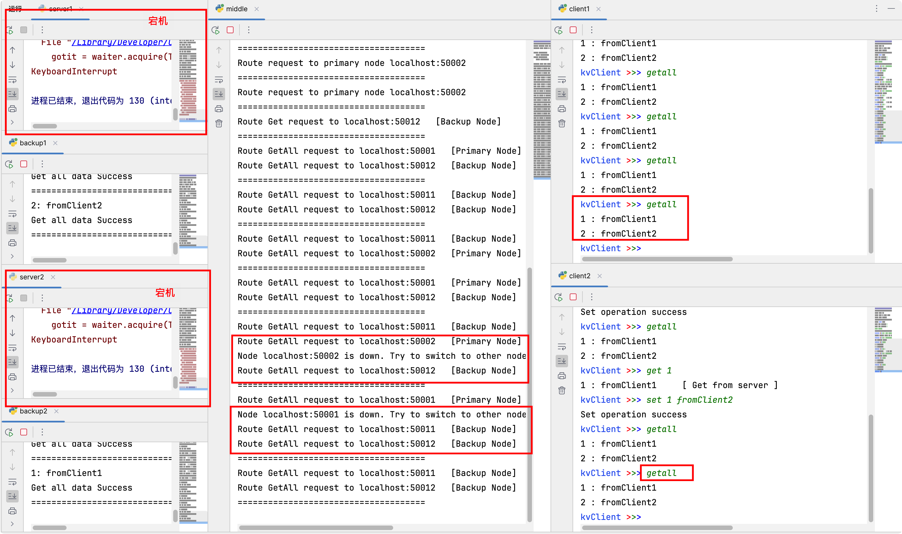
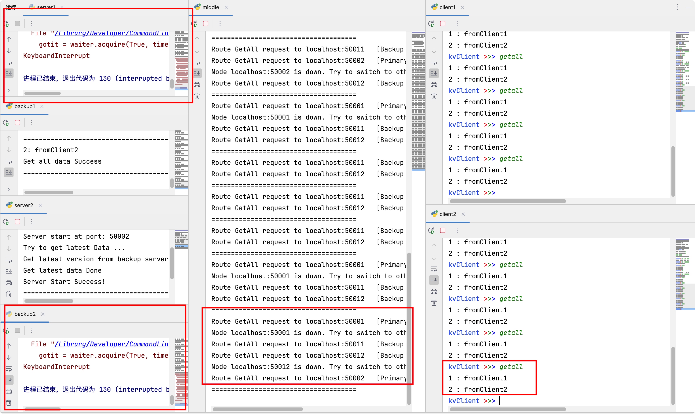

# Distributed Key-Value Store

> @Author: Xxxxic

## Usage
 
Run ` python -m grpc_tools.protoc -I=./lib --python_out=. --grpc_python_out=. kvstore.proto
` to generate kvstore_pb2.py and kvstore_pb2_grpc.py

## Test

Run `test/server.py` and `test/backup.py` to start the Server of the system

Run `test/middle.py` to start the MiddlewareProxy

Run `test/client.py` to start the Client

And then you can test the correctness of the system.

##  TODO 
1. Asynchronous Backup (Or multi-threading)
2. Consistent hash: additions and deletions of nodes
2. Raft
4. User isolation
5. ~~User security~~(Done)
