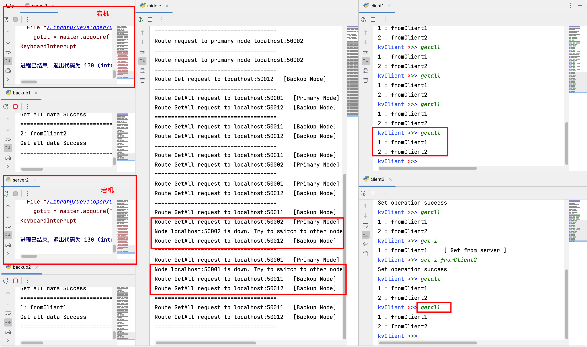
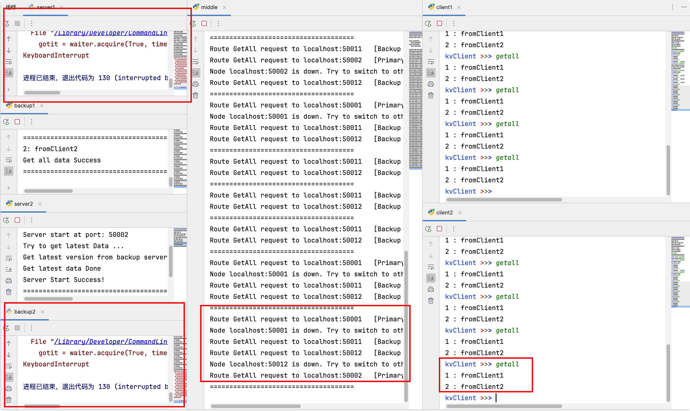

# 分布式键值存储

> @Xxxxic

## 用法
运行 ` python -m grpc_tools.protoc -I=./lib --python_out=. --grpc_python_out=. kvstore.proto
`  

生成 kvstore_pb2.py 和 kvstore_pb2_grpc.py 对应的 gRPC 库

## 测试

运行`test/server.py`和`test/backup.py`来启动系统的服务器

运行`test/middle.py`启动中间件代理

运行`test/client.py`启动客户端

